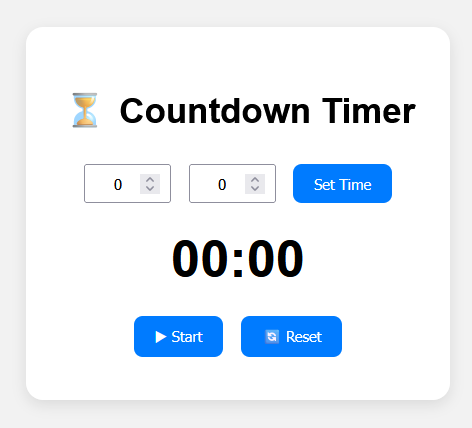

```markdown
# Countdown Timer App

A simple countdown timer web application built with React + Vite.  
Users can set a custom time (minutes & seconds), start, pause, and reset the timer.

---

## UI Preview



---

## Features

- Set countdown time (minutes & seconds)
- Start, pause, and reset the timer
- Built using React functional components, props, `useState`, and `useEffect`

---

## Component Hierarchy
```

App
├── TimeSetter
│ └── props: { onSetTime }
│
├── TimerDisplay
│ └── props: { remaining }
│
└── ControlButtons
└── props: { isRunning, onStart, onPause, onReset }

````

---

## Component Details

### App (Parent)
- Role: Main container; manages state, countdown logic, and passes props to children.
- State:
  - `time`: total time set in seconds
  - `remaining`: time left in seconds
  - `isRunning`: boolean flag for timer state

### TimeSetter (Child)
- Role: Input for minutes & seconds, sets the timer.
- Props:
  - `onSetTime(minutes, seconds)` → function from App to update timer duration

### TimerDisplay (Child)
- Role: Displays countdown in `MM:SS` format.
- Props:
  - `remaining` → number of seconds left in countdown

### ControlButtons (Child)
- Role: Provides Start, Pause, and Reset controls.
- Props:
  - `isRunning` → boolean to toggle Start/Pause
  - `onStart` → start countdown
  - `onPause` → pause countdown
  - `onReset` → reset countdown to initial set time

---

## Installation & Setup

```bash
# Clone the repo
git clone https://github.com/your-username/countdown-timer.git
cd countdown-timer

# Install dependencies
npm install

# Run development server
npm run dev
````

---

## Deployment

Build the project and deploy to any static hosting provider (e.g., Vercel, Netlify):

```bash
npm run build
```

Upload the generated `dist/` folder to hosting provider.

---

## Tech Stack

- React + Vite
- CSS (custom)
- React Hooks (`useState`, `useEffect`)

```

```
